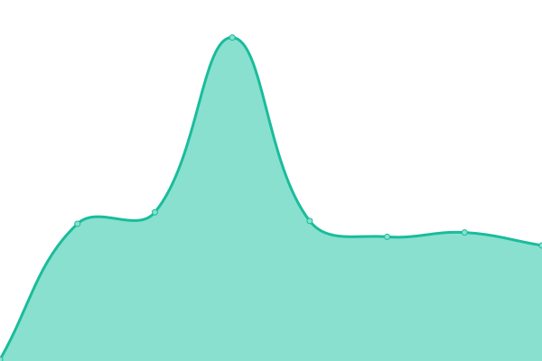

# [📈 Live Status](https://pwtsai.github.io): <!--live status--> **🟩 All systems operational**

This repository contains the open-source uptime monitor and status page for [pwtsai](https://pwtsai.github.io/), powered by [Upptime](https://github.com/upptime/upptime).

With [Upptime](https://upptime.js.org), you can get your own unlimited and free uptime monitor and status page, powered entirely by a GitHub repository. We use [Issues](https://github.com/pwtsai/upptime/issues) as incident reports, [Actions](https://github.com/pwtsai/upptime/actions) as uptime monitors, and [Pages](https://pwtsai.github.io) for the status page.

<!--start: status pages-->
<!-- This summary is generated by Upptime (https://github.com/upptime/upptime) -->
<!-- Do not edit this manually, your changes will be overwritten -->
<!-- prettier-ignore -->
| URL | Status | History | Response Time | Uptime |
| --- | ------ | ------- | ------------- | ------ |
|  [AS57401](https://peering.oftein.net) | 🟩 Up | [as-57401.yml](https://github.com/pwtsai/upptime/commits/HEAD/history/as-57401.yml) | 

 418ms
     
 | 

<a href="https://pwtsai.github.io/history/as-57401">100.00%</a>
    

|  [AS38254](https://connect.itlab.cc) | 🟩 Up | [as-38254.yml](https://github.com/pwtsai/upptime/commits/HEAD/history/as-38254.yml) | 

 157ms
     
 | 

<a href="https://pwtsai.github.io/history/as-38254">100.00%</a>
    

|  [AS211622](https://network.pwtsai.im/) | 🟩 Up | [as-211622.yml](https://github.com/pwtsai/upptime/commits/HEAD/history/as-211622.yml) | 

 228ms
     
 | 

<a href="https://pwtsai.github.io/history/as-211622">100.00%</a>
    

<!--end: status pages-->

[**Visit our status website →**](https://pwtsai.github.io)

## 📄 License

- Powered by: [Upptime](https://github.com/upptime/upptime)
- Code: [MIT](./LICENSE) © [pwtsai](https://pwtsai.github.io/)
- Data in the `./history` directory: [Open Database License](https://opendatacommons.org/licenses/odbl/1-0/)
